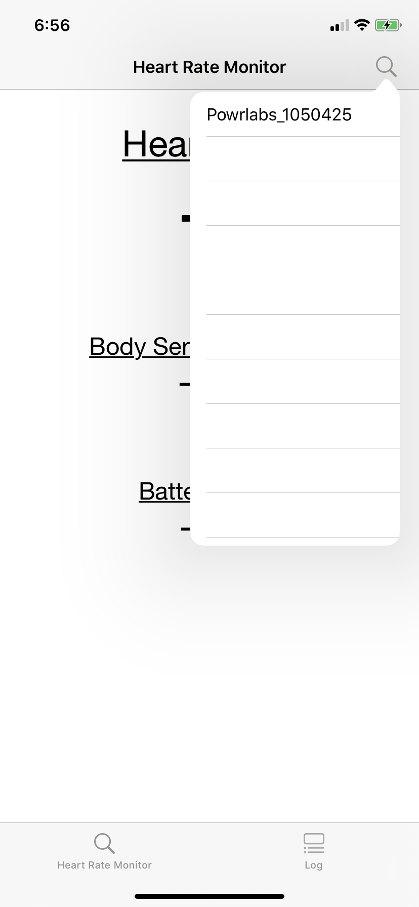
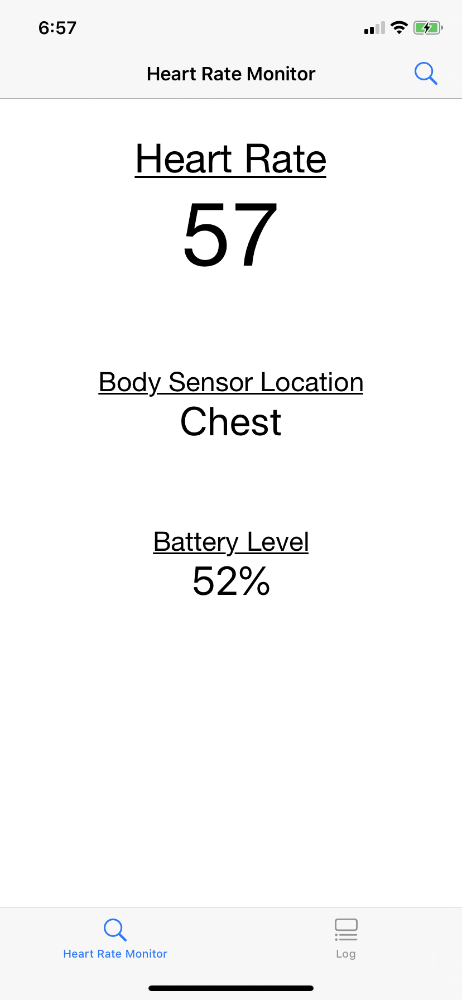
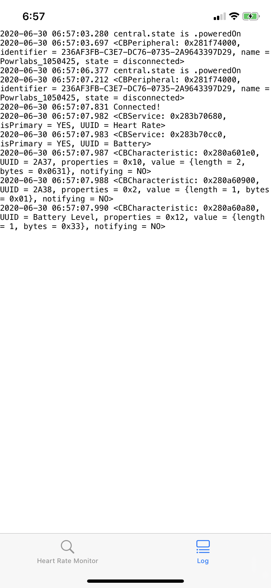

# BluetoothHeartRateMonitor
A Simple iOS App that Monitors Heart Rate through Bluetooth Devices

## Usage:
1. Select your device from the list of Bluetooth Heart Rate Monitors

2. Check your Heart Rate (measured in bpm)

3. You can also check the Bluetooth Log in the Log tab

